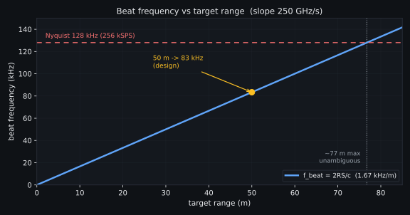

# Figures

All figures in the design documents are generated from source and committed as
`.svg` (and `.png` for the data plots). The documents reference the `.svg` files;
nothing in the rendered HTML is hand-drawn. This mirrors the PMVB figure pipeline.

## Two kinds of figure

| Kind | Source | Toolchain | Use for |
| --- | --- | --- | --- |
| **TikZ** | `*.tex` | `pdflatex` -> `pdftocairo -svg` | block diagrams, signal-chain schematics, pin maps, timing sketches |
| **Data plot** | `*.py` | Python + matplotlib | computed curves (beat-vs-range, filter response, spectra) |

Pick TikZ when the figure is a *diagram* (boxes, wires, geometry). Pick matplotlib
when the figure is *plotted data* from an equation or a simulation.

## Layout

```
docs/figures/
  build-all.ps1            # builds everything (TikZ + matplotlib)
  BUILD.md                 # this file
  style/
    pmvb-figures.sty       # shared house style: dark theme, node/edge styles
  system-design/           # figures for the System Design Document
    fmcw_chirp_beat.tex    # Fig 5-1  (TikZ)
    beat_vs_range.py       # Fig 5-2  (matplotlib)
    range_resolution.py    # Fig 5-3  (matplotlib)
  rf-frontend/             # (future) RF Front-End Module figures
  baseband/                # (future) I/Q Baseband Board figures
```

Each per-board doc gets its own subdirectory under `docs/figures/`. `build-all.ps1`
discovers them automatically.

## Build

From `docs/figures/`:

```powershell
.\build-all.ps1
```

This compiles every `*.tex` (skipping `style/`) to `.svg` and runs every `*.py`
plot script. It needs `pdflatex` (MiKTeX) and `pdftocairo` (Poppler) on PATH for
TikZ, and Python with `matplotlib` + `numpy` for the plots.

Build a single figure by hand:

```powershell
# TikZ
cd system-design
pdflatex fmcw_chirp_beat.tex
pdftocairo -svg fmcw_chirp_beat.pdf fmcw_chirp_beat.svg

# matplotlib
python beat_vs_range.py
```

## Authoring a new figure

**TikZ.** Start from this preamble; dark mode is applied automatically.

```latex
\documentclass[border=8pt]{standalone}
\input{../style/pmvb-figures.sty}
\begin{document}
\begin{tikzpicture}[pmvb figure]
  % use pmvb subsystem / pmvb ic / pmvb digital / pmvb analog / pmvb power ...
  % colors: pmvbFg pmvbMuted pmvbBlue pmvbGreen pmvbAmber pmvbRed pmvbViolet
\end{tikzpicture}
\end{document}
```

See `system-design/00`-style legends in the PMVB repo for the full box/wire
vocabulary defined in `pmvb-figures.sty`.

**matplotlib.** Copy the palette block from `system-design/beat_vs_range.py`
(`BG / PANEL / FG / MUTED / GRID / BLUE / AMBER / RED / GREEN`), use
`matplotlib.use("Agg")`, and `savefig(..., facecolor=BG)` to both `.svg` and `.png`.

## Referencing figures in a document

Reference the compiled `.svg` with a relative path from the document, wrapped in a
`<figure>` so the SDD theme styles the caption:

```html
<figure>

<figcaption><strong>Figure 5-2.</strong> Beat frequency versus target range ...</figcaption>
</figure>
```

Always rebuild figures before rendering the document, so the `.svg` files are current.
